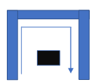

## Smart City (My Problem) Simulation
**Supermarket Food Waste Simulation**

The problem of Supermarket Food waste is a complex one that does not have an analytical solution and therefore a simulation is required to help test the hypothesis of whether heavily discounting produce leads to less produce inventory that needs to be discarded.  In order to solve this an Agent Based Simulation was selected as the most appropriate category to solve the simulation.  Agent Based Simulation (ABS) was chosen due to the focus of the issue being the buying habits of customers (Agents) and how these can/cannot be swayed by a large change in price of up to 75% off.

The simulation would be constructed in an ABS program, such as Anylogic.  The simulation would be constrained to the produce department where an entrance/exit would be created for customers (Agents) to enter and exit the area.  The entrance/exit is to the hypothetical rest of the store and the produce area would have a limit on the number of customers who can enter it.

The setup of the produce area will be kept simple to allow the focus to be on the buying patterns of the customers.  The area will be simple U shape where customers enter on one side of the “U” and exit on the other.  The produce will be laid out on the outside (blue section) with the path the customers walk on the inside.  The heavily discounted section will be a section in the middle of hte "U" (the black section on the diagram).

Vegetable and fruit sections will alternate in the blue areas and will be assigned random quantities from 0 to 50 and the reduced section area will have a max quantity of 100 and eaach section will have a price associated with buying 1 of that section's item.  There will be 3 of each section which will be labeled "Fruit 1", "Fruit 2" and "Fruit 3" and "Vegetable 1", "Vegetable 2", and "Vegetable 3."  The produce will be restocked in the sections every 3 days with all produce remaining put into a center discounted section (black section) and on day 4 will be 50% of original price, and on day 5 will be 25% of original price and on day 6 all produce in this section will be removed and replaced with newer stock from the shelves.  The amount sold from the sections and the amounts sold from the discounted section will be added together and subtracted from the total quantities on day 1 to determine the amount that was discarded and will be collected by the simulation.  

To facilite the most accurate interactions between the agents and the produce, based on the complexity of the model, surveys will be conducted of 1000 consumers to determine their produce buying habits.  Questions will be asked about what is looked for when they buy produce such as if the consumer looks at price when selecting produce, do they judge quality before selecting the item, does a price reduction sway them to buy different items, and would heavily discounting an item (50% to 75% off) influence them into a purchase.  This data would used to create Agents for the simulation that behave in a more realistic manner in respect to buying habits and would help create a simulation with more meaningful results than just randomly assigned values.

For this simulation each customer has a set threshold to determine if they will purchase a particular fruit or vegetable and will be randomly assigned up to 10 items to purchase from the six different areas.  The customer has a set criteria for the age of the produce they will purchase, however, this criteria can be swayed by price point to the degree determined from the survey.  

The customers have a set criteria for the age of produce that they will purchase.  However, this criteria can be swayed by price point.  For this simulation the threshold for purchase is a value between 7 and 10 and is randomly assigned to each agent.  Produce that has been the shelf 1 day or less has a value of 10, produce that is 2 days old has a value of 9, produce that is 3 days old has a value of 8.  Produce that is 4 days old has a value of 6 and produce that is 5 days old has a value of 4.  

Based on the survey results about how much a large price reduction will affect the decision to purchase a random value will be assigned to each produce item that is discounted and this number will be added to the value based on the age of the produce to determine if the agent will buy the item.  An example is the 50% price reduction giving a value between 0 and 3 while the 75% reduction gives a value between 0 and 6.

The user defined inputs would be the range of values for the purchase threshold, range of values for the added value of the price reduced produce, the price of the produce in each section, the max quantity of the produce in each section, the number of days before produce gets moved to the discounted section, the size of the produce area.  The outputs wold be the number of items sold in a given number of days, the age when the produce was purchased, the purchase price of the sold produce and how much produce was thrown away.
